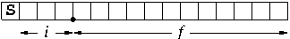

_fxopt_
============

A floating-point to fixed-point arithmetic conversion plugin for gcc

Author
  ~ K. Joseph Hass

Copyright
  ~ Copyright (C) 2014 Kenneth Joseph Hass
  ~ This program is free software: you can redistribute it and/or modify
    it under the terms of the GNU General Public License as published by
    the Free Software Foundation, either version 3 of the License, or
    (at your option) any later version.
  ~ This program is distributed in the hope that it will be useful, but
    WITHOUT ANY WARRANTY; without even the implied warranty of
    MERCHANTABILITY or FITNESS FOR A PARTICULAR PURPOSE. See the GNU
    General Public License for more details.

**This file is an excerpt from the full documentation, which can be found in
the `html` folder.**

Introduction
============

_Fxopt_ is a plugin for gcc that converts floating-point arithmetic to
fixed-point arithmetic. The conversion formats the operands for each
operation so that overflow cannot occur, and attempts to do so while
preserving the maximum possible accuracy of the result. The end result
of this process is an object file, as is normally the case when running
gcc. The user may also choose to convert the object file to an assembly
code file. For verification purposes, the fixed-point code can be
converted into a standard C language version that corresponds exactly to
the behavior of the object/assembly version.

The plugin manipulates the GIMPLE intermediate format used by gcc,
replacing floating-point variables and operators with fixed-point
variables and operators. New statements are inserted into the code as
necessary to reformat variables before performing arithmetic operations.

*fxopt* supports several optional optimization methods that can be
enabled or disabled via command line switches. These are

-   Conversion of single-precision multiplications to double precision.
-   Conversion of division by a constant to multiplication by the
    inverse.
-   Range estimation using interval arithmetic
-   Range estimation using affine arithmetic
-   Rounding before truncation
-   Rounding with a run-time check for correcting negative values

In many cases, _fxopt_ can generate a fixed-point function with accuracy
comparable to single-precision floating-point while reducing the
execution time by an order of magnitude. If floating-point accuracy is
not needed then even greater improvements in run time can be achieved.

Fixed-point arithmetic
======================

The most primitive numerical datatype in a digital computer is the
*integer*. The usual default is that an integer is assumed to be
*signed*, which means that it can represent either positive or negative
values. Signed integers are almost always in two's-complement format.
For an -bit signed integer the range of representable
values is from  to
. Although the terminology is not quite
correct, we often refer to the most significant (leftmost) bit of a
two's-complement value as the *sign bit*, because this bit is always a 1
if it represents a negative integer.

Real numbers are typically represented digitally as *floating-point*
values. A floating-point number actually consists of three separate
values: the mantissa,the exponent, and the sign. If we ignore the
details, the real number represented by a floating-point value is equal
to

Because they include an exponent, floating-point numbers have an
extremely wide range when compared to integers. However, keeping track
of the exponent and performing arithmetic operations on floating-point
values is much more complicated than performing the same operations on
integers.

Fixed-point arithmetic is a method of performing calculations that tries
to use integer arithmetic operators when working with real numbers.
Fixed-point values have an exponent, but the exponent is determined at
compile time and the exponent for a given variable never changes at run
time. The exponent is always an integer power of 2, so you can also say
that the exponent determines the location of the (implied) binary point
location in the value. Since the exponent never changes for a given
variable it is also true that the radix point never moves, so these
values are called *fixed-point* values.

A simple 16-bit fixed-point number is shown in the figure below. The
most-significant bit (MSB) is reserved for conveying sign information
and is marked with an **S**. In this case we have decided that the
binary point location is between 4 bits on the left and 12 bits on the
right. The bit immediately to the left of the binary point has a place
value of  (the "ones" bit). The next bit to the
left has a place value of  (the "twos" bit), and
the next bit moving left has a place value of  (the
"fours" bit). These bits are like the "ones", "tens", and "hundreds"
digits in the decimal arithmetic we learned as children. Since all of
the bits to the left of the binary point have a place value that is
equal to an integer these bits will be collectively known as the
*integer bits*.

The bit that is immediately to the right of the binary point has a place
value of , or one-half. As we move to the right
the place value is halved for each bit, so the right-most
least-significant bit (LSB) has a place value of
.

An equally correct way of interpreting this fixed-point value is to
consider it to be an integer with an implied exponent of
. Fixed-point values are sometimes called
*scaled integers*, where there is an implied scale factor equal to the
implied exponent. To convert a fixed-point value to a real number we can
view the value as an integer and just divide it by the scale factor.
Similarly, to convert a real number to its fixed-point representation we
can multiply the real number by its scale factor and discard the
fractional part of the result.

Now if a given fixed-point variable has  integer bits
and  fraction bits then the range of real values that
can be represented by this variable is  to
. The resolution of the
fixed-point variable (the smallest difference between two values) is
. Therefore, the range of real numbers that can
be represented is determined mainly by  and the
achievable precision is determined by .

Determining the optimum location for the binary point for a given
variable is a compromise between its range and the precision. If we want
to keep the same size for the variable then we can either sacrifice
precision for a wider range or sacrifice the width of the range in order
to get greater precision. However, the penalty for not having enough
range is that calculations can overflow and give grossly incorrect
results. Therefore, the choice of a binary point location is often made
so that overflow cannot possibly occur.

A quick example
===============

This is a quick example of how a floating-point C function can be
converted into an equivalent function that uses fixed-point arithmetic
with integer operators. For the time being we will ignore many of the
details and options.

Suppose we have the following function that converts a voltage from a
temperature sensor to the corresponding temperature:

    double sensor(double InVal)
    {
      double Vin, TempC;
      Vin = 3.3 * InVal / 4096.0;
      TempC = Vin * 100.0;
      return TempC;
    }

We assume that the analog-to-digital converter (ADC) provides a 12-bit
integer value ranging from `0` to `4095`. Assume that the full-scale
range of the ADC is 3.3 V and the temperature sensor scale is 10
mV/°Celsius. The first executable line calculates the actual input
voltage, `Vin`, and the second executable line converts that voltage to
a temperature in °C.

Before using the plugin you need to make a small modification to the
input file. A requirement for any conversion of floating-point to
fixed-point is knowing the fixed-point format of the fixed-point
variables. We change the function declaration to indicate that the raw
ADC values are actually integers and the 12 bits are right-justified in
a 32-bit word, which means that we have 20 redundant sign bits and no
fraction bits:

    double sensor(double __attribute__ ((fxfrmt(20,12,0))) InVal)

Installing _fxopt_ can be as simple as copying the `fxopt.so` file from
the repository onto your computer. The plugin is invoked by adding the
following switches to the `gcc` command line:

-   `-fplugin=/my/full/path/to/fxopt.so`
-   `-fplugin-arg-fxopt-ref-pass-name=ssa`
-   `-fplugin-arg-fxopt-ref-pass-instance-num=1`

If we want to see how _fxopt_ changes the internal representation of the
function we can have gcc write out the function just before and after
invoking the plugin with these command line switches:

-   `-fdump-tree-ssa`
-   `-fdump-tree-veclower`

In addition to the usual files generated by gcc we have two extra files,
`sensor.c.017t.ssa` and `sensor.c.018t.veclower`. Examining the gcc
intermediate representation before _fxopt_ runs, in `sensor.c.017t.ssa`,
we find:

    D.1947_2 = InVal_1(D) * 3.2999999523162841796875e+0;
    Vin_3 = D.1947_2 * 2.44140625e-4;
    TempC_4 = Vin_3 * 1.0e+2;

Note that the first executable line of C has been replaced with two
lines of code in the intermediate representation, because only a single
operation is allowed per statement. The division by 4096.0 has already
been converted into a multiplication by its reciprocal, 2.44140625e-4.
It's not obvious but the real constants are single-precision
floating-point values, which means that they have no more than 24 bits
of precision.

The intermediate representation produced by _fxopt_ is found in
`sensor.c.018t.veclower`. The important executable statements from this
file are:

    D.1947_2 = InVal_1(D) * 432538;
    _fx_shft1.0_6 = D.1947_2 >> 12;
    Vin_3 = _fx_shft1.0_6 * 1;
    _fx_shft1.1_7 = Vin_3 >> 7;
    TempC_4 = _fx_shft1.1_7 * 100;

The real constant `3.3` has been converted to a fixed-point constant
with a value of `432538`. Examining the _fxopt_ transcript we see that the
constant is assumed to have 2 integer bits and 17 fraction bits. The
real value represented by this constant is . Multiplying this constant by `InVal` (with
12 integer bits and no fraction bits) yields a product with 1 sign bit,
14 integer bits, and 17 fraction bits. This is the most precise result
we can get with 32-bit operations.

_Fxopt_ assumes that the constant 2.44140625e-4 is represented with the
most advantageous fixed-point format possible. In this case, _fxopt_
assumes that the constant will be represented with 20 sign bits, no
integer bits, and 12 fraction bits. Before performing the multiplication
_fxopt_ must reformat the variable `D.1947_2` so that the product will not
overflow, and this is accomplished by shifting right 12 bit positions
and storing the shifted value in a new variable, `_fx_shft1.1_7`. Since
the 12 least significant fraction bits have been discarded,
`_fx_shft1.1_7` has 13 sign bits, 14 integer bits, and 5 fraction bits.
After multiplying by the constant, the product will have 1 sign bit, 14
integer bits, and 17 fraction bits. The multiplication is actually
performed in the third statement, where the real fraction is replaced by
its fixed-point value of 1 (remember that the equivalent real value is
 since the constant has 12 fraction
bits). _Fxopt_ can actually do a much better job of optimizing this
multiplication, as we will see later.

The final calculation, multiplying the input voltage by 100, is
performed in the last two statements. _Fxopt_ sees that multiplying the
value in `Vin` by 100 could cause an overflow, so the value of `Vin` is
shifted right 7 places before performing the multiplication.The
fixed-point format of the result, `TempC`, has 1 sign bit, 21 integer
bits, and 10 fraction bits.

The intermediate representation produced by _fxopt_ does properly convert
the floating-point arithmetic to fixed-point but it is clearly not
optimized. This is not only acceptable, it is desirable, because it
allows the remaining gcc optimization steps as much freedom as possible
to reduce the size and/or execution time of the final object file.

For example, the temperature conversion function was compiled using
_fxopt_ with a cross-compiler that targeted the ARM Cortex-M3
architecture. Using the `-O2` optimization switch results in the
assembly code shown below. Note that the trivial multiplication by 1 has
been removed, and the two right shift operations have been combined into
a single instruction.

    movw r3, #39322  ; 0x999a
    movt r3, #6      ; R3 = 0x6999A = 432538
    mul.w r3, r3, r0 ; R3 = InVal * 432538
    movs r0, #100    ; R0 = 100
    asrs r3, r3, #19 ; Vin = R3 >> 19
    mul.w r0, r0, r3 ; TempC = Vin * 100
    bx lr

At this point it is worth asking about the accuracy of this computation.
The maximum difference between the fixed-point calculation and a
double-precision floating-point computation is 0.095 °C over all 4096
possible input values. In most applications this level of accuracy is
acceptable, particularly when the benefit is 10X to 100X faster
execution and smaller code size. If not, then the optional fixed-point
accuracy optimization switches can be applied to improve the accuracy to
a level that is superior to single-precision floating-point.

Using _fxopt_
===========

Installing _fxopt_
----------------

Note
  ~ To use the _fxopt_ plugin you must have a version of gcc that supports
    plugins. _Fxopt_ was originally developed using version 4.6.1 and
    should work with any version newer than that.

A compiled version of _fxopt_ is available in the repository, and you may
be able to use it directly. To do so you need only download the
`fxopt.so` shared object file.

If you wish to modify and recompile _fxopt_ you will need the gcc source
files as well as the source files for _fxopt_ itself. In addition, _fxopt_
uses the hash lists and doubly-linked lists provided by Troy Hanson's
*uthash* package. The source code for this package is available at
[https://github.com/troydhanson/uthash](https://github.com/troydhanson/uthash).

Note
  ~ I had to edit the *uthash* code to use `xmalloc` instead of `malloc`
    in the sections of code that creates new hash or list elements.

Plugins for gcc must be compiled to shared object files, with an `.so`
extension, and an appropriate Makefile for compiling _fxopt_ from the
source files is provided in the repository.

Note
  ~ If your gcc is a 64-bit executable then _fxopt_ must also be compiled
    as a 64-bit executable, and if your gcc is a 32-bit executable then
    _fxopt_ must be compiled as a 32-bit executable. In other words, the
    version of gcc used to create _fxopt_ must have the same size as the
    version that executes _fxopt_.

A common practice is to compile _fxopt_ itself using a *native* compiler,
so that the _fxopt_ executable has the same binary format as the gcc that
was used to compile it, and then to use _fxopt_ with a *cross-compiler*
that produces code for an architecture different than that of the
computer used to perform the compilation. For example, you might compile
_fxopt_ itself on your desktop computer and then use a cross-compiler to
create software for an embedded system. In this scenario both the native
compiler and the cross-compiler must have the same type of executable
(e.g. an ELF 64-bit LSB executable).

Preparing the source file
-------------------------

A necessary prerequisite for converting floating-point calculations to their
fixed-point equivalents is knowing the format of the input parameters, and it
is impossible to design a fixed-point calculation without that information. To
use _fxopt_, every function parameter *must* include a specification for the
binary point location. In some cases the input parameters will be read from some
hardware interface, such as an analog-to-digital converter (ADC), which will
dictate the format.

_Fxopt_ defines a new attribute named *fxfrmt* that can be used to specify the
binary point location for variables as well as their minimum and maximum values.
As shown in the example above, C function parameter definitions are modified to
add the fxfrmt attribute:

    double sensor(double __attribute__ ((fxfrmt(20,12,0))) InVal)

The basic syntax for a C attribute is `__attribute__ (( ))` where the attribute
name and parameters are enclosed between the double parentheses. Note that
there are two underscores before and after the `attribute` keyword. The fxfrmt
attribute accepts three, four, or five integer parameters, which must be in the
specified order:

1.  the number of sign bits in the parameter's fixed-point format
2.  the number of integer bits in the format
3.  the number of fraction bits in the format
4.  the maximum possible value of the parameter
5.  the minimum possible value of the parameter

If only the first three parameters are supplied then _fxopt_ assumes that the
maximum and minimum values of the variable are the maximum and minimum values
that can be represented with the specified number of integer and fraction bits.

Note
  ~ When the fxfrmt attribute is used as shown here, with three
    arguments that specify the number of sign, integer, and fraction
    bits, the variable is assumed to be a **signed** value. The maximum
    and minimum values of the variable are assumed to be the maximum and
    minimum values that can be represented in the specified format. If
    the function parameter is actually unsigned or is known to have a
    more restricted range then additional arguments can be provided with
    the fxfrmt attribute to provide that information to _fxopt_.

Running the compiler
--------------------

As with any plugin, _fxopt_ is enabled by adding switches to the command line
when invoking gcc. There are three command line switches that must be used to
activate the plugin:

-   **`-fplugin=/the_path_to_the_plugin/fxopt.so`** provides a complete
    path to the shared object file for the plugin
-   **`-fplugin-arg-fxopt-ref-pass-name=ssa`** specifies that the plugin
    should be run after the optimization pass that converts the input
    source code to the static-single-assignment (SSA) form
-   **`-fplugin-arg-fxopt-ref-pass-instance-num=1`** specifies that the
    plugin should be run after the SSA pass runs for the first time

Controlling the conversion process
----------------------------------

Range estimation is a powerful method for improving the quality of the
fixed-point computations produced by _fxopt_. Determining a variable's largest
possible magnitude allows _fxopt_ to optimize the fixed-point format of that
variable and maintain the greatest accuracy. Because _fxopt_ was created as a
research tool, its default mode of operation does not perform range estimation
and only the fixed-point *formats* of the operands are used to determine a
format for the result of an operation, such that no overflow can occur. Better
results can be had by enabling one of the range estimation techniques described
below.

-   **`-fplugin-arg-fxopt-interval`** The interval option enables the
    use of interval arithmetic to determine the possible range of all operands.
    Interval arithmetic determines the range of the result of an operation using
    the minimum and maximum possible values of the operands.

    For example, suppose that `InVal` is an 8-bit, signed input parameter to a
    function and _fxopt_ knows that it has 1 sign bit, no integer bits, and 7
    fraction bits. Suppose we have calculations like:

        Pi = 3.14;
        Bar = 2.5;
        Foo = Pi * Bar * InVal;

    The variables `Pi` and `Bar` will both require 2 integer bits for their
    fixed-point representations. Based solely on the format information and our
    understanding of how multiplication works, we would expect that `Foo` would
    require 4 integer bits.

    When interval arithmetic is enabled, _fxopt_'s internal specification of
    every variable includes not only its fixed-point format information but also
    the minimum and maximum possible values of that variable. The range of the
    result of a simple arithmetic operation can be determined easily, given the
    ranges of the operands. In this example, `Pi` has a range of [3.14,3.14] and
    the range of `Bar` is [2.5,2.5]. Based solely on its fixed-point format,
    `InVal` has a range a [0x80,0x7F] which is equivalent to a real number
    range of [-1.0,0.9921875]. The range of `Foo` is easily calculated to be
    [-7.85,7.788671875]. Now we see that only 3 integer bits are required in the
    fixed-point representation of `Foo`.

    Since the number of bits in a variable is fixed, reducing the number of
    integer bits required allows us to increase the number of fraction bits.
    This increases the available resolution of a fixed-point variable and
    typically improves the accuracy of computations.

-   **`-fplugin-arg-fxopt-affine`** The affine option enables the use of
    affine arithmetic to determine the range of all operands. With this option
    enabled, _fxopt_ determines an equation for each variable that expresses
    its value as a linear function of the input variables and known constants.
    Affine range estimates exploit the correlation that occurs when the same
    input variables appear in the affine definitions for the operands of an
    arithmetic operation. Non-affine operations, such as multiplication and
    division, introduce error terms. Nevertheless, affine range estimates are
    often more accurate than those determined using simple interval arithmetic.

    For example, suppose that `InVal` is an 8-bit, signed input parameter to a
    function and _fxopt_ knows that it has 1 sign bit and 7 fraction bits. This
    variable's range is [0x80,0x7F] which is equivalent to a real number range
    of [-1.0,0.9921875]. Suppose we have calculations like:

        Foo = 5 * InVal - 3;
        Bar = Foo - InVal;

    Within gcc this code is converted into 3 primitive operations:

        Temp = 5 * InVal;
        Foo = Temp - 3;
        Bar = Foo - InVal;

    If simple interval arithmetic is used, the range of `Temp` is first
    determined to be [-5.0,4.9609375]. Subtracting 3 gives `Foo` a range
    of [-8.0,1.9609375]. Finally, subtracting `InVal`, with its range of
    [-1.0,0.9921875], is equivalent to adding a range of [-0.9921875,1.0] and
    leaves `Bar` with a range of [-8.9921875,2.9609375].

    By using affine arithmetic, _fxopt_ recognizes that `Bar` is equal to (4 \*
    InVal)-3 and assigns this variable a range of [-7.0,0.96875]. If interval
    arithmetic is used we need to allocate 4 bits to represent the integer part
    of `Bar`, but with affine arithmetic we see that only 3 bits are actually
    needed. The bit that was freed from the integer portion of `Bar` can be
    used instead to increase its fractional resolution. In practice, increased
    resolution leads to improved accuracy in the computations.

While range estimation improves the accuracy of the fixed-point computations
with little or no run-time penalty, there are other trade-offs that can increase
accuracy only at the cost of increased execution time and executable code size.
Several command-line switches can be used when executing gcc to allow _fxopt_
to add additional instructions in certain situations to improve accuracy. By
default, these options are disabled.

-   **`-fplugin-arg-fxopt-round`** When enabled, this option causes
    rounding to be performed with a run-time adjustment for signed, negative
    values. For example, a shift operation without rounding might be:

        fx_shft1 = SomeVariable >> 8;

    (Note that the right shift operator used in gcc's intermediate format is an
    arithmetic shift that preserves the sign of signed operands, unlike the same
    operator in C.)

    The error introduced by this truncation can be greatly reduced by adding a
    constant equal to one-half the value of the least-significant bit of the
    shifted value. The value of this constant can be determined at compile time,
    since the size of the shift is also known at compile time, so this rounding
    step requires just one additional statement to add the constant.

        fx_shft1 = (SomeVariable + (1 << 7)) >> 8;

    However, this rounding method does not produce the desired result when the
    original value is negative and the truncated bits are exactly equal to one
    half of the remaining LSB. To eliminate the error from this (admittedly
    rare) case, a run-time adjustment is done. If the variable being shifted
    is negative then a signed integer value of 1 must be subtracted before
    truncation, thereby ensuring that the variable will be rounded toward
    negative infinity rather than toward 0. It is generally desirable to avoid
    conditional instructions (such as testing the variable's sign) so _fxopt_
    will instead add a value of -1 if the variable is negative. By shifting
    the original variable right we can obtain a value that will be -1 if the
    variable is negative or 0 if the variable is positive, and then this value
    can be unconditionally added to the variable. Note that this rounding
    procedure requires the insertion of a shift operation and two addition
    operations.

        fx_sign = SomeVariable >> (size_of(SomeVariable) - 1);
        fx_shft1 = (SomeVariable + (1 << 7) + fx_sign) >> 8;

-   **`-fplugin-arg-fxopt-round-positive`** This option causes _fxopt_ to
    assume that any quantity to be rounded is non-negative. The run-time
    adjustment for negative values (described above) is never added to the
    executable code, which can significantly reduce the code size and execution
    time of the fixed-point computations. However, eliminating this adjustment
    can introduce a small bias, or offset, into the data that may reduce the
    accuracy of the final results.

-   **`-fplugin-arg-fxopt-guard`** Since rounding is performed by adding
    a constant to a value before truncation, it is possible that an overflow can
    occur when the constant is added. Enabling this option causes _fxopt_ to
    determine whether a given rounding operation might cause an overflow, and to
    prevent that overflow by creating a redundant sign bit (a *guard* bit). To
    create the guard bit, _fxopt_ inserts a right shift of 1 bit position before
    the rounding step.

    For example, shifting `SomeVariable` right by 8 bit positions, with
    rounding, is equivalent to this statement:

        fx_shft1 = (SomeVariable + (1 << 7)) >> 8;

    If the guard option is enabled and _fxopt_ determines that the addition step
    in this statement might cause an overflow, then the rounding operation will
    instead be performed as:

        fx_shft2 = SomeVariable >> 1;
        fx_shft1 = (fx_shft2 + (1 << 6)) >> 7;

    The disadvantage of using the guard option is that an additional run-time
    operation is added to the rounding step. Since guarding is only required
    when _fxopt_ determines that rounding *might* cause an overflow, a robust
    range analysis of the operands can often prevent it from being necessary.

-   **`-fplugin-arg-fxopt-dpmult`** The dpmult option instructs _fxopt_ to
    use a double-precision multiplication operation. By default, all
    floating-point operands are converted to integer operands of the same size
    and the integer multiplication operator returns a result of that size.
    Binary multiplication naturally produces a result that has twice as many
    bits as the operands, so the single-precision multiplication operation
    effectively discards the upper half of the result. To ensure that the result
    of a single-precision multiplication is valid, _fxopt_ must therefore reduce
    the precision of the operands *before* performing the multiplication.

    For example, if 32-bit integers are used then the floating-point statement:

        Product = Multiplier * Multiplicand;

    might be converted to fixed-point as:

        fx_shft1 = Multiplier >> 16;
        fx_shft2 = Multiplicand >> 16;
        Product = fx_shft1 * fx_shft2;

    Enabling double-precision multiplications would instead convert the
    floating-point multiplication to something like:

        fx_wide = Multiplier w* Multiplicand;
        Product = fx_wide >> 32;

    where `w*` is the "wide multiply" operator used internally by gcc.

    The effect of double-precision multiplication on the execution time of
    the converted computations can vary greatly, depending upon the relative
    execution time of multiplication and shifting in the target processor.
    However, using single-precision multiplication can lead to serious
    degradation in the accuracy of the results.

    Note that even when the dpmult option is enabled, _fxopt_ detects
    circumstances where using a double-precision multiplication provides no
    accuracy benefit and reverts to a single-precision multiplication in those
    situations. This is often the case when the multiplier is a small constant.

-   **`-fplugin-arg-fxopt-div2mult`** Enabling this option will cause
    _fxopt_ to convert all division operations with a constant divisor to
    multiplication by a constant multiplier. While gcc often performs this
    conversion automatically for integer operations it may not be done by
    default for floating-point operations.

